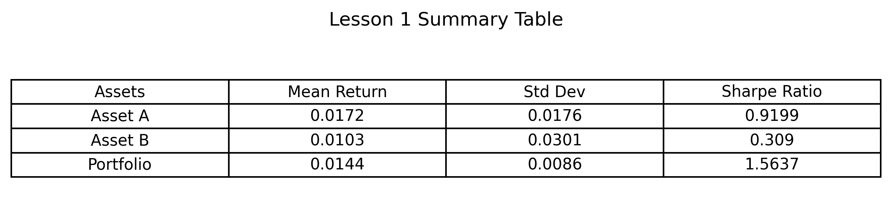

# Lesson 1 Interpretation - Financial Data Basics

## Summary Table

## Interpretation

Based on the calculated returns, Asset A has the highest mean return at 1.72%, while Asset B has the highest volatility at 3.01%. This means Asset A generated the strongest average return in this sample, while Asset B had the largest return fluctuations.

The portfolio consists of 60% Asset A and 40% Asset B. It has a mean return of 1.44% and the lowest standard deviation at 0.86%. This suggests a diversification benefit, because combining the two assets reduced volatility compared with holding either asset individually.

Using the Sharpe ratio, the portfolio provides the best risk-adjusted performance. Its Sharpe ratio is 1.5637, which is higher than both Asset A and Asset B. This means that, within this sample, the portfolio delivers the highest excess return per unit of risk.
